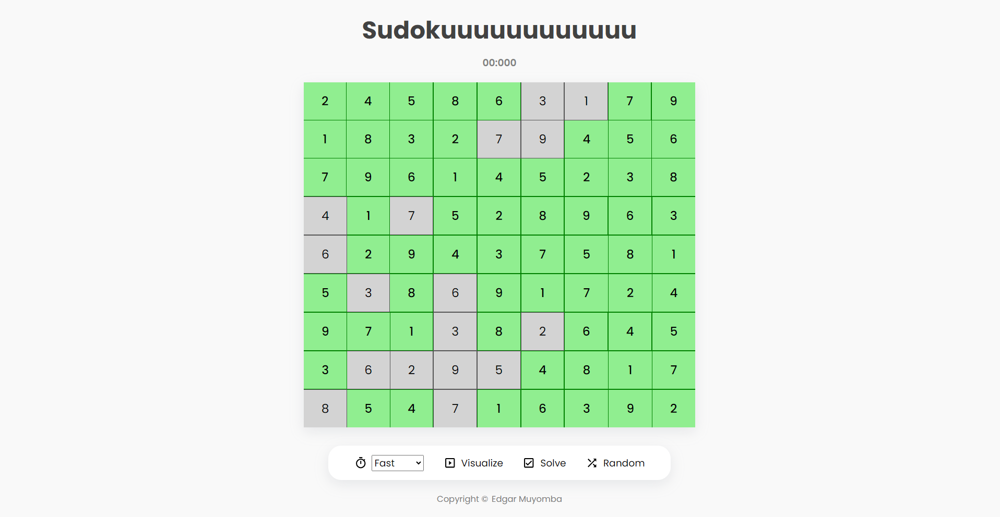
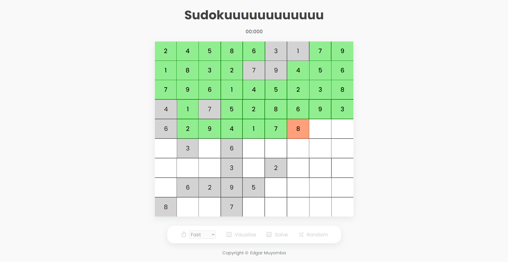

# Sudoku Solver

This is a react application used to solve the famous numbers game, [Sudoku](https://sudoku.com). Currently it only provides the ability to generate a random puzzle from an open source api, [Dosuku](https://sudoku-api.vercel.app/), solve the given board and visualize the working algorithm.

This project demonstrates my understanding of the working of simple algorithms and their use for complex use cases. In this case, the working of the backtracking algorithm and the use of matrices.

The live project can be found [here](https://sudoku-solver-eight-pi.vercel.app/).

## Final Solution


## Working Visualization


## Setting up dev
1. Clone the repository
   ```bash
   git clone <url>
   ```
2. Install the necessary dependencies
   ```bash
   npm install
   ```
3. Run the server
   ```bash
   npm run dev
   ```

## Technologies
1. [React](https://react.dev/)
2. [Typescript](https://www.typescriptlang.org/)
3. [Scss](https://sass-lang.com/)

> [!CAUTION]
> At the time of this writing - 28th Aug, 2024, it seems like the owner of the sudoku api I was using appears to have taken it down. ( Evidence by the 404 error logged in the browser when a new board is clicked ). The tool might therefore lack the ability to generate a new board. This may or may not be fixed as I look for an alternative API. Feel free to reach out at [edgarmatthew247@gmail.com](mailto:edgarmatthew247@gmail.com) if you have any alternative. Thanks!